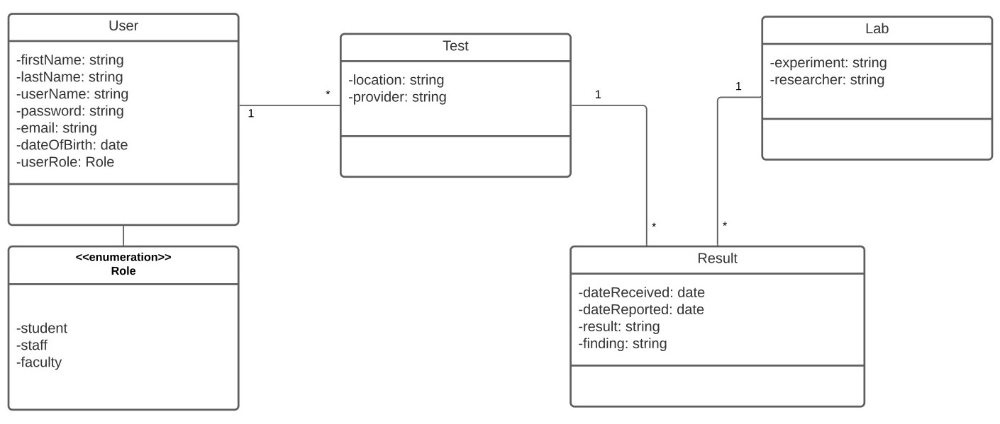

# Northeastern University COVID-19 Testing Database
## Group 5: Thomas Jacob (Section 04) and Matthew Kugler (Section 04)
## CS 3200 Spring 2021, Dr. Annunziato

## Table of Contents
1. [Project Overview](#Project-Overview)
2. [UML Diagram](#UML-Diagram)
3. [Data Models](#Data-Models)
    1. [User Data Model](#User)
       1. [User Role (enumerated datatype)](#Role)
    2. [Domain Object Models](#Domain-Object-Models)
        1. [Test](#Test)
        2. [Lab](#Lab)
        3. [Result](#Result)
4. [Web Application User Interface](#Interface)
    1. [Navigation between Class Webpages](#Navigation)
5. [Additional Information for Running the Application](#Info)

## Project Overview
For our project, we created a database to track and manage the COVID-19 test results for various members of the 
Northeastern University community. The database web application that we have developed grants the ability to create, 
read, update, and/or delete records from our user model or domain object models.

## UML Diagram
Here is the conceptual model of our project, shown as a UML class diagram:

## Data Models:
### User Data Model
Our User data model represents the current members of the Northeastern community whose COVID-19 tests are being tracked 
in the database. The User data model records each person's first and last name (strings), email address (string), 
username and password (strings) to login to Northeastern's COVID-19 Test Scheduler, data of birth (date), and role 
(Role [enumerated datatype]).

#### User Role (enumerated datatype) 
Role is a portable enumeration which we implemented on the User data model. This was done to identify each user of 
the Northeastern community as one of a student, staff, or faculty. This is done to ensure that only members of the 
Northeastern community are receiving COVID-19 tests from the university. This is also necessary because the 
university has different testing protocols in place, depending on the role of the User.

### Domain Object Models
There are three domain object data models which our interface employs:
* Test
* Lab
* Result

#### Test domain model
The Test domain object model represents all the COVID-19 tests that a User may receive. It captures the location where 
the test was administered (string), as well as the name of the medical provider who administered the test (string). This 
domain model contains a foreign key attribute which directly references the ID of the User whom the test was given 
to.

There is a one-to-many (1-*) relationship between User and Test, as Northeastern University requires each member of 
its community to receive multiple COVID-19 tests each week. 

#### Lab domain model
The Lab domain object model represents the various laboratories that run experiments on the COVID-19 tests 
administered by Northeastern University. For this project domain, we created three unique labs that each run a 
specific experiment on all COVID tests (string). All experiments are run by a certain researcher (string).

The three experiments that these labs specialize in are PCR, RNA-Seq, and ELISA. Since each lab only specializes in 
one of these experiments, the university distributes all COVID tests to all three labs in order to obtain the most 
information it can for each test.

#### Result domain model
The Result class contains information about when each COVID test was received by each lab (date) and when the result of
the test was reported (date). It also states the actual result of the test (COVID positive vs. COVID negative
[string]) which each lab found, as well as any additional findings that pertain to the user's overall health and
well-being.

The Result domain object model is a mapping class that reifies the many-to-many relationship between Test and Lab. 
Since all COVID-19 tests are sent to all three labs, the Result object model represents the results and findings of 
each COVID-19 test that was uncovered from each lab's experiments. Therefore, there is a one-to-many (1-*) 
relationship between Test and Result, as well as between Lab and Result.

## Web Application User Interface
When the web application first loads, the home screen shows all records from each data class on the home page, each 
stored as a hyperlink. When any of these links are clicked, they will navigate you to an editor screen which 
will show all fields of the given record. In this editor screen, you will be able to do the following:
* modify and update any of that record's fields by typing in new information and clicking the green `Save` button 
* delete the record entirely by clicking on the red `Delete` button
* cancel any operations by clicking the yellow `Cancel` button

On the home screen underneath each class' heading is a blue `Add <object>` button that allows you to create a 
new record for that particular class. When clicked, you will be redirected to that class' editor page and will 
be prompted to type in all attributes pertaining to the new record being created. Once all desired records are 
inputted, the new record will be saved by clicking on the `Save` button.

When any of these buttons (except `Add <object>`) are clicked, it will redirect you back to the home screen 
with the respective operation having taken place.

### Navigation between Class Webpages
Our web application implements the following navigation between class webpages:
* When a `User` object is clicked on, the application navigates you to the User Editor screen which lists links to the 
  past COVID-19 tests which that user has taken. 
    * Each of these links navigates you to the Test Editor to view the corresponding `Test` object.
    
* When a `Test` object is clicked on, the application navigates you to the Test Editor screen. This screen links 
  the User whom this test belongs to, as well as the results for the test which were reported by each of the three labs.
  * The link for each test's user redirects you to the User Editor screen to view the `User` object for whom that test 
    belongs to.
  * The links listed for each COVID-19 result redirect you to the Result Editor screen to view the specific `Result` 
    object corresponding to that test.
    
* When a `Lab` object is clicked on, the application navigates you to the Lab Editor screen. This screen lists links 
  for every test result which this lab has reported. 
  * Each of these links redirects you to the Result Editor screen to view the specific `Result` object published by 
    that lab.
    
* When a `Result` object is clicked on, the application navigates you to the Result Editor screen. This screen lists 
  a single link for the Lab which published this result, as well as a single link for the Test where this result 
  came from.
  * The link for the corresponding Lab redirects you to the Lab Editor screen to view the particular `Lab` object 
    that published that Result.
  * The link for the corresponding Test redirects you to the Test Editor screen to view the particular `Test` object 
  where the sample was obtained from. 
    
## Additional Information for Running the Application
The application requires running the scripts `/src/main/java/finalProject/DemoApplication_finalProject.java` as 
well as `/src/main/resources/application.properties`. These two scripts enable connection to the server via the internet.

### A note about `application.properties`
For this project to run as intended, we made the following changes in `application.properties`:
* The MySQL connection was established by setting `dbDesign` as both the username and password. Please change the 
  username and password found in `application.properties` to match the user credentials used to connect to MySQL.
* we set `spring.jpa.hibernate.ddl-auto` equal to `none`, instead of `update`
  * this was done to prevent the creation of new SQL tables in our database and to prevent currently existing tables 
    from being modified.
* we implemented ONLY the following naming strategies:
  * `spring.jpa.hibernate.naming.implicit-strategy=org.hibernate.boot.model.naming.ImplicitNamingStrategyLegacyJpaImpl`
  * `spring.jpa.hibernate.naming.physical-strategy=org.hibernate.boot.model.naming.PhysicalNamingStrategyStandardImpl`
  * these changes were made to prevent additional SQL columns (using snake casing) from being created when the 
    necessary columns already exist (using camel casing)

### Other actions to take before running the application
Prior to running `DemoApplication_finalProject.java`, make sure to establish a connection to MySQL and implement the 
schemas found in `src/main/SQL`. Once these schemas are rendered, connect the classes found in 
`src/main/java/finalProject/models` to the MySQL data source.

The application will not run properly unless these changes are made, and the appropriate data source is mapped to the 
java classes.
